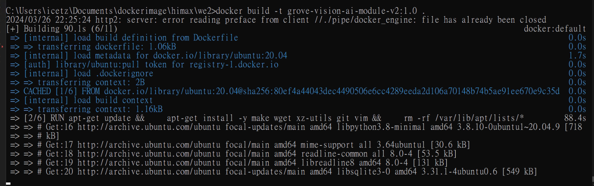
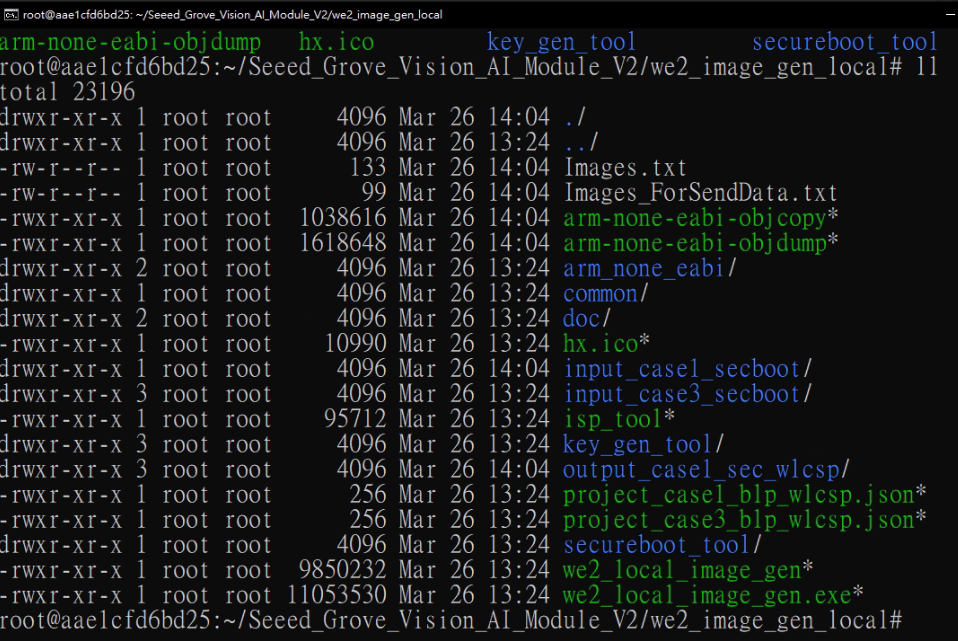
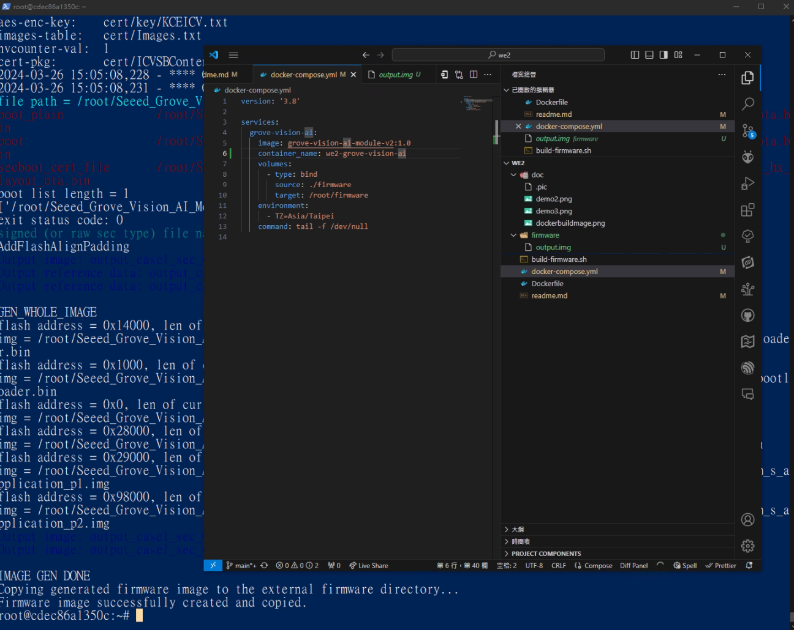
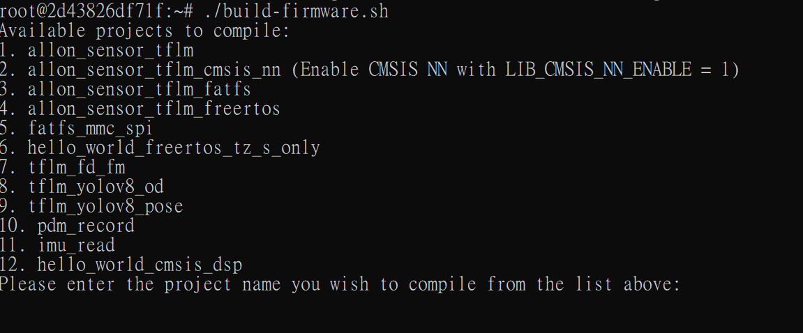
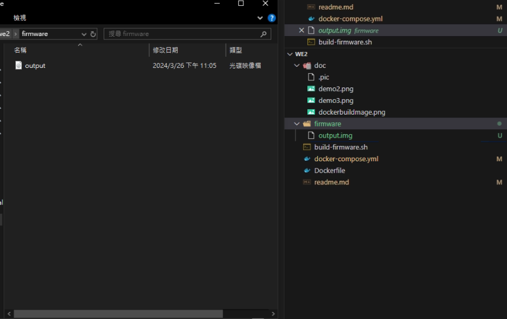

# Grove Vision AI Module V2 Firmware Compilation

This repository contains the Docker configuration for building firmware for the Grove Vision AI Module V2 on a Linux environment, specifically tested on Ubuntu 20.04.

[Seeed Grove Vision AI Module V2 GitHub Repository](https://github.com/HimaxWiseEyePlus/Seeed_Grove_Vision_AI_Module_V2)

## Prerequisites

- Docker installed on your system.
- Basic understanding of Docker and containerization.

## Building the Docker Image

Clone this repository to your local machine and navigate into the cloned directory. Build the Docker image using the following command:

```bash
docker build -t grove-vision-ai-module-v2:1.1 .
```


This command builds a Docker image named grove-vision-ai-module-v2 with the tag 1.0 based on the Dockerfile in the current directory.

## Running the Container(without docker-compose)

To run the container and compile the firmware, use the following command:

```bash
docker run -it --name we2-grove-vision-ai grove-vision-ai-module-v2:1.0 /bin/bash
```

If you wish to mount a directory from your host machine to the container to store the firmware files, use the following command:

```bash
docker run -it --name we2-grove-vision-ai -v /path/to/local/firmware:/root/firmware grove-vision-ai-module-v2:1.0
```

Make sure to replace /path/to/local/firmware with the path to the directory on your host machine where you want the firmware files to be stored.

## Running the Container(docker-compose)

To start the Grove Vision AI service in detached mode (i.e., in the background), run the following command:

```bash
docker-compose up -d
```

This command starts your Docker containers in the background, allowing you to continue using the terminal while they run.

## Accessing the Container

If you need to access the container after it is running, you can start a bash shell inside the container using:

```bash
docker exec -it we2-grove-vision-ai /bin/bash
```





This command provides you with interactive shell access to the running container. If the container uses a different shell, such as sh, you should replace /bin/bash with /bin/sh.

Note: You need to have the container running in the background to use the exec command. If the container is not running, first start it using the docker-compose up -d command.

## Run builder sh file

```bash
./build-firmware.sh
```





## Cleaning Up

To stop and remove the container when you are done, use the following command:

```bash
docker-compose down
```

This command stops the running container and removes it.

## Notes

- The build script and Dockerfile are configured based on the assumption that they will be run on a Linux environment, specifically tested on Ubuntu 20.04.
- Make sure that the build-firmware.sh script is in the same directory as your Dockerfile and that it has executable permissions.
